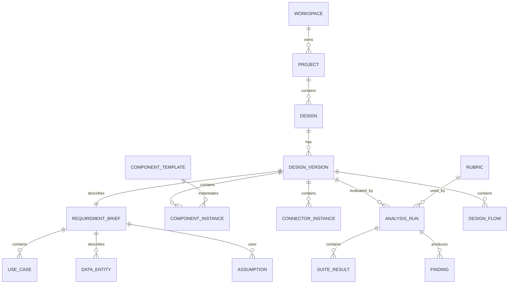

# Domain Model

## 1. Core Objects



## 2. Workspace

Represents an enterprise account or organization.

Fields:

- `id`
- `name`
- `plan`
- `dataResidency`
- `defaultModelPolicy`
- `createdAt`
- `updatedAt`

## 3. Project

Groups related designs.

Fields:

- `id`
- `workspaceId`
- `name`
- `description`
- `ownerTeam`
- `tags`
- `createdAt`
- `updatedAt`

## 4. Design

Represents a named architecture artifact.

Fields:

- `id`
- `projectId`
- `title`
- `summary`
- `status`: `draft`, `in_review`, `approved`, `deprecated`
- `ownerUserId`
- `ownerTeam`
- `currentVersionId`
- `createdAt`
- `updatedAt`

## 5. DesignVersion

Immutable snapshot of a design at a point in time.

Fields:

- `id`
- `designId`
- `versionNumber`
- `parentVersionId`
- `branchName`
- `changeSummary`
- `requirements`
- `requirementBrief`
- `assumptions`
- `constraints`
- `risks`
- `graph`
- `createdBy`
- `createdAt`

The `graph` contains component instances, connectors, layout, and metadata.

## 5.1 RequirementBrief

Structured understanding of the system being designed.

Fields:

- `id`
- `designVersionId`
- `problemStatement`
- `primaryActors`
- `functionalRequirements`
- `qualityRequirements`
- `trafficEstimate`
- `consistencyRequirements`
- `complianceNeeds`
- `openQuestions`
- `completenessScore`

The requirement brief should preserve whether values were user-provided, estimated, imported, or assumed.

## 5.2 UseCase

Structured workflow the design must support.

Fields:

- `id`
- `requirementBriefId`
- `actor`
- `goal`
- `steps`
- `criticality`
- `successCriteria`
- `relatedFlowIds`

## 5.3 DataEntity

Business or system data object used by the design.

Fields:

- `id`
- `requirementBriefId`
- `name`
- `owner`
- `description`
- `classification`
- `estimatedRows`
- `averageRecordSizeBytes`
- `growthRate`
- `retention`
- `residency`
- `accessPatterns`
- `consistencyRequirementIds`

## 5.4 Assumption

Explicit assumption used to design or evaluate the system.

Fields:

- `id`
- `designVersionId`
- `statement`
- `source`: `user_provided`, `estimated`, `model_inferred`, `workspace_default`
- `confidence`
- `impact`
- `status`: `proposed`, `accepted`, `rejected`, `superseded`

## 6. ComponentTemplate

Reusable definition of a component type.

Fields:

- `id`
- `workspaceId`
- `type`
- `name`
- `description`
- `icon`
- `requiredFields`
- `optionalFields`
- `defaultValues`
- `validationRules`
- `deprecatedAt`

Global templates can have `workspaceId = null`.

## 7. ComponentInstance

Concrete component placed on a design.

Fields:

- `id`
- `templateId`
- `name`
- `componentType`
- `position`
- `metadata`
- `owner`
- `dataClassification`
- `capacity`
- `scaling`
- `failureModes`
- `observability`

Example metadata for an LLM component:

```json
{
  "model": "internal-support-agent",
  "provider": "workspace-managed",
  "promptVersion": "support-agent-v12",
  "inputData": ["customer_message", "account_context"],
  "outputData": ["reply_draft", "confidence"],
  "fallback": "human_review_queue",
  "latencyBudgetMs": 3000,
  "safetyControls": ["pii_redaction", "policy_classifier"]
}
```

## 8. ConnectorInstance

Typed relationship between components.

Fields:

- `id`
- `sourceComponentId`
- `targetComponentId`
- `connectorType`
- `protocol`
- `payload`
- `auth`
- `timeoutMs`
- `retryPolicy`
- `ordering`
- `dataClassification`
- `metadata`

## 8.1 DesignFlow

Named end-to-end path through the graph.

Fields:

- `id`
- `designVersionId`
- `name`
- `useCaseId`
- `trigger`
- `steps`
- `latencyBudgetMs`
- `failureBehavior`
- `relatedRequirementIds`

## 9. Rubric

Evaluation policy used to score a design.

Fields:

- `id`
- `workspaceId`
- `name`
- `description`
- `version`
- `categories`
- `weights`
- `requiredChecks`
- `modelPromptVersion`
- `createdBy`
- `createdAt`

Rubrics should be versioned because analysis results only make sense relative to the rubric used at the time.

## 10. AnalysisRun

One evaluation attempt against one design version.

Fields:

- `id`
- `designVersionId`
- `rubricId`
- `rubricVersion`
- `status`
- `score`
- `categoryScores`
- `summary`
- `modelProvider`
- `modelName`
- `promptVersion`
- `inputHash`
- `outputHash`
- `createdBy`
- `startedAt`
- `completedAt`
- `error`

## 10.1 SuiteResult

Result of one evaluation suite within an analysis run.

Fields:

- `id`
- `analysisRunId`
- `suiteId`
- `readiness`: `ready`, `partial`, `blocked`, `not_applicable`
- `qualityScore`
- `confidence`
- `summary`
- `missingInputs`
- `assumptionsUsed`
- `evidence`
- `recommendedNextActions`

## 11. Finding

Specific issue, risk, question, or recommendation.

Fields:

- `id`
- `analysisRunId`
- `severity`: `info`, `low`, `medium`, `high`, `critical`
- `category`
- `title`
- `description`
- `evidence`
- `recommendation`
- `relatedComponentIds`
- `relatedConnectorIds`
- `confidence`
- `status`: `open`, `accepted`, `resolved`, `dismissed`

## 12. Comment

Human review comment.

Fields:

- `id`
- `designId`
- `designVersionId`
- `authorId`
- `body`
- `relatedComponentId`
- `relatedConnectorId`
- `createdAt`
- `resolvedAt`
