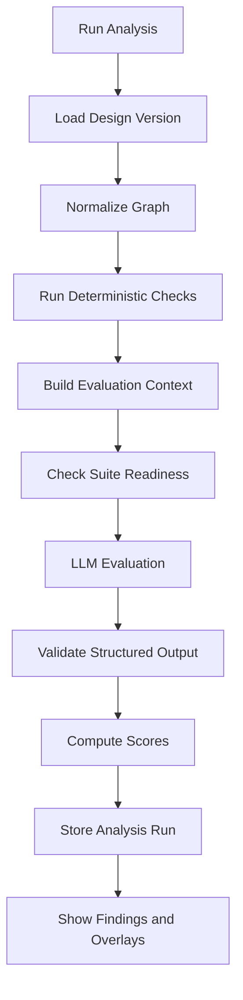

# Evaluation Engine

## 1. Evaluation Goal

The evaluation engine should help teams improve system designs. It should not only produce a score.

Good output answers:

- What is strong about this design?
- What is missing?
- What risks are material?
- Which assumptions need validation?
- What should change before implementation?
- Which company standards are violated?
- How did this version improve or regress compared with the last version?

## 2. Evaluation Pipeline



## 3. Deterministic Checks

Before using an LLM, run checks that do not require reasoning:

- Components without owners.
- Connectors without protocols.
- Sensitive data flows without auth metadata.
- Internet-facing services without edge/security components.
- Databases without backup or replication notes.
- AI components without fallback behavior.
- Queues without dead-letter handling.
- Synchronous chains exceeding latency budget.
- Missing observability components.
- Missing requirements or assumptions.

These checks create reliable baseline findings and also improve the LLM context.

Beyond simple rules, the platform should run mathematical and graph-based checks where possible:

- Reachability analysis for sensitive data, public entry points, and observability paths.
- Critical path latency analysis for synchronous flows.
- Queue throughput and backlog estimates.
- Storage growth estimates.
- Single point of failure detection for critical use cases.
- Retry amplification and idempotency checks.
- Consistency mismatches between use-case requirements and connector/data-store behavior.

See [Formal and Mathematical Architecture Analysis](formal-architecture-analysis.md) for the detailed model.

## 4. Evaluation Suites

Evaluation should be organized into modular suites. A design can run all applicable suites or only the suite relevant to the user's current question.

Default suites:

- Requirement understanding.
- Traffic and capacity.
- Consistency and data integrity.
- Reliability and failure handling.
- Security and privacy.
- Observability and operations.
- Cost and efficiency.
- AI and model risk.

Each suite should report:

- Readiness: whether enough structured data exists for credible analysis.
- Quality score: how well the design satisfies the concern.
- Missing inputs.
- Evidence.
- Findings.
- Questions.
- Recommended next actions.

See [Evaluation Suites](evaluation-suites.md) for the lower-level suite model.

## 5. Rubric Categories

Default enterprise rubric:

- Requirements fit.
- Scalability.
- Reliability and failure handling.
- Data model and storage choices.
- API and integration design.
- Security and privacy.
- AI/model risk, if applicable.
- Observability and operations.
- Cost and capacity awareness.
- Simplicity and maintainability.
- Migration and rollout strategy.

Each category should have:

- Weight.
- Scoring guide.
- Required evidence.
- Common failure patterns.
- Recommended fixes.

## 6. AI-Specific Evaluation

For AI-backed systems, evaluate:

- Prompt and model ownership.
- Input and output data classification.
- PII handling.
- Hallucination containment.
- Human-in-the-loop path.
- Fallback behavior when the model is unavailable.
- Evaluation dataset and acceptance criteria.
- Latency and cost budget.
- Tool permission boundaries.
- Auditability of model decisions.
- Versioning of prompts, models, and policies.

## 7. Structured Analysis Output

The model should return a controlled schema:

```json
{
  "summary": "Short evaluation summary",
  "overallScore": 78,
  "confidence": 0.74,
  "suiteResults": [
    {
      "suiteId": "requirement_understanding",
      "readiness": "partial",
      "qualityScore": 68,
      "missingInputs": ["peakQps", "dataRetention"]
    }
  ],
  "categoryScores": [
    {
      "category": "reliability",
      "score": 70,
      "rationale": "The design includes queues but lacks consumer failure handling.",
      "evidence": ["queue component exists", "no DLQ connector found"]
    }
  ],
  "findings": [
    {
      "severity": "high",
      "category": "security",
      "title": "Sensitive customer data reaches LLM without redaction control",
      "description": "The support service sends account context to the LLM, but no redaction or policy filter is modeled.",
      "evidence": ["connector support-service -> llm includes account_context"],
      "recommendation": "Add a PII redaction step before the model call and log policy decisions.",
      "relatedComponentIds": ["support-service", "support-llm"],
      "confidence": 0.82
    }
  ],
  "questions": [
    "What is the acceptable fallback path when the model exceeds the latency budget?"
  ]
}
```

## 8. Findings Overlay

Findings should be visible in three places:

- Analysis report.
- Canvas badges on related components and connectors.
- Version comparison view.

This keeps AI analysis connected to the diagram instead of becoming detached prose.

## 9. Version-Aware Analysis

The review endpoint can target either the current working design or an immutable saved version. A review is also scoped to a deliberate lens such as security, reliability, scalability, data, operability, or cost. The UI must keep the selected target visible so findings are never mistaken for feedback about another version.

When comparing versions, the system should identify:

- New risks.
- Resolved risks.
- Regressed categories.
- Improved categories.
- Components added, removed, or changed.
- Connectors added, removed, or changed.
- Rubric changes that affect score comparability.

Example:

> Reliability improved from 62 to 78 because the new version adds a queue, retry policy, and dead-letter path. Security regressed from 84 to 72 because the new analytics export includes customer metadata without retention controls.

## 10. Human Review Loop

Teams should be able to:

- Accept a finding as valid.
- Dismiss a finding with a reason.
- Convert a finding into a task.
- Mark a finding resolved in a later version.
- Add reviewer comments.

Dismissals should feed future evaluation tuning, especially for workspace-specific rubrics.

## 11. Guardrails

- Never overwrite human design decisions automatically.
- Clearly label model-generated analysis.
- Store model, prompt, rubric, and input hashes.
- Show confidence and evidence for findings.
- Allow analysis to run with redacted metadata.
- Avoid sending secrets or raw sensitive payloads to external models.

## 12. Grounded Architecture Chat

Architecture chat is a persistent, design-scoped review surface rather than a general-purpose assistant:

- Each conversation belongs to one workspace and design and may be pinned to a saved version.
- Every response is grounded in the structured graph, requirements, and deterministic evaluation evidence.
- Component and connector references returned by the model are checked against the selected document before they become navigable UI links.
- Design content is treated as untrusted input and cannot override system instructions.
- Suggestions never mutate the design implicitly; a human must apply every change.
- Conversation messages are stored independently from design documents and version history.
- Provider endpoints reject unsafe network targets by default, responses are size-bounded, and chat requests are rate-limited.
