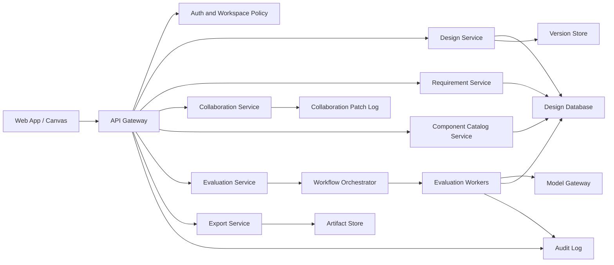

# System Architecture

## 1. Architecture Goals

The platform should support:

- Low-latency canvas editing.
- Durable design storage.
- Versioned architecture artifacts.
- AI analysis jobs that may run asynchronously.
- Structured exports.
- Enterprise access control and auditability.
- Future collaboration and integrations.

See [Platform and Tech Stack Tradeoffs](platform-and-tech-stack.md) for the web-vs-desktop decision and recommended implementation stack.

## 2. High-Level Architecture

## 3. Frontend

Responsibilities:

- Canvas editor.
- Component palette.
- Connector creation and editing.
- Property inspector.
- Design version timeline.
- Analysis panel.
- Findings overlay on diagram elements.
- Export controls.
- Review and comment UI.

Recommended approach:

- Use a canvas library that supports nodes, edges, zooming, selection, and custom components.
- Keep the visual state and structured design graph synchronized.
- Store drafts locally during editing and persist snapshots intentionally.

## 4. API Layer

Responsibilities:

- Workspace, project, and design CRUD.
- Version creation and retrieval.
- Component catalog APIs.
- Rubric management.
- Analysis run orchestration.
- Export generation.
- Comments and review state.
- Permission checks.

The API should separate draft editing from immutable versions. A design can have a mutable working copy, but saved versions should be immutable.

## 5. Design Service

Responsibilities:

- Store design documents.
- Validate graph structure.
- Create immutable versions.
- Compute diffs between versions.
- Track ownership, status, and review state.
- Resolve references to catalog components.

The design service is the core system of record.

## 6. Component Catalog Service

Responsibilities:

- Manage built-in component types.
- Manage workspace-specific component templates.
- Enforce required metadata fields.
- Support reusable design patterns.
- Track deprecated components or preferred replacements.

Example:

- A generic `database` component may exist globally.
- A company-specific `payments-postgres-primary` template may add owner, backup policy, encryption defaults, and review requirements.

## 7. Evaluation Service

Responsibilities:

- Build the analysis context from the design graph, requirements, metadata, previous versions, and rubric.
- Dispatch AI evaluation jobs.
- Normalize model outputs into structured findings.
- Store scores, evidence, recommendations, and unresolved questions.
- Support deterministic checks before LLM evaluation.

The evaluation service should not trust raw model output directly. It should parse and validate the model response into a controlled schema.

## 8. Model Gateway

Responsibilities:

- Route requests to supported model providers.
- Apply workspace model policies.
- Redact or transform sensitive data where required.
- Track prompt versions and model versions.
- Enforce timeouts, retries, rate limits, and cost controls.

The gateway keeps model usage auditable and makes later provider changes easier.

## 9. Export Service

Responsibilities:

- Export diagrams as PNG/SVG/PDF.
- Export structured architecture as JSON.
- Export readable docs as Markdown.
- Export Mermaid diagrams.
- Later export Terraform-style inventories, ADR templates, RFC documents, or ticket payloads.

Exports should include the design version ID and analysis version ID so artifacts remain traceable.

## 10. Storage

Suggested storage:

- Relational database for workspace, users, projects, design metadata, versions, comments, analyses, and rubrics.
- JSONB or document storage for design graph snapshots.
- Object storage for images, PDFs, attachments, and large exports.
- Queue for analysis and export jobs.
- Append-only audit log for enterprise traceability.

## 11. Reliability Considerations

- AI analysis should be asynchronous for non-trivial designs.
- Failed model calls should not corrupt design state.
- Every analysis run should have status: queued, running, succeeded, failed, canceled.
- Users should be able to retry failed analysis runs.
- Partial deterministic checks should be shown even if model analysis fails.
- Exports should be reproducible from immutable versions.
