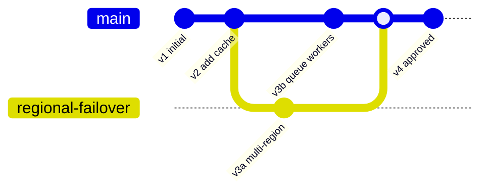

# Versioning and Exports

## 1. Why Versioning Matters

Enterprise architecture work is iterative. The system should preserve how a design changes, why it changes, who changed it, and what analysis said at each point.

Versioning turns the product from a whiteboard into a design system of record.

## 2. Versioning Model

Each design has:

- A mutable working draft.
- Immutable saved versions.
- Optional branches for alternatives.
- Analysis runs tied to exact versions.
- Exports tied to exact versions and analysis runs.



## 3. Version Snapshot Contents

A version should include:

- Design graph.
- Layout coordinates.
- Component metadata.
- Connector metadata.
- Requirements.
- Assumptions.
- Constraints.
- Risks.
- Attached files or references.
- Change summary.
- Author and timestamp.

## 4. Diff Types

Support several diff views:

- **Visual diff:** Highlight added, removed, and changed nodes/edges.
- **Metadata diff:** Show property-level changes.
- **Analysis diff:** Compare scores and findings.
- **Export diff:** Compare structured JSON or Markdown exports.

## 5. Review Status

Suggested statuses:

- `draft`
- `ready_for_review`
- `reviewed_with_findings`
- `approved`
- `superseded`
- `deprecated`

Approval should reference a version, not a mutable design.

## 6. Export Formats

### JSON

Machine-readable source of truth.

Use cases:

- Import/export between workspaces.
- Feed internal automation.
- Archive design history.
- Generate docs.

### Markdown

Human-readable architecture summary.

Use cases:

- RFCs.
- ADRs.
- Engineering docs.
- Pull request descriptions.

### Mermaid

Lightweight diagram export.

Use cases:

- GitHub docs.
- Internal wiki pages.
- Design review notes.

### PNG/SVG/PDF

Visual snapshot.

Use cases:

- Review decks.
- Architecture documents.
- Executive summaries.

## 7. Structured Design Language

The product should define a compact structured language for exports. This can start as JSON and later support YAML. The canonical lower-level schema direction lives in [Structured Design Language](structured-design-language.md); this section shows the export shape at a glance.

Example:

```yaml
design:
  id: customer-support-ai
  version: 4
  title: Customer Support AI Assistant
  requirements:
    - answer customer questions using account context
    - route low-confidence answers to human agents
  components:
    - id: web-app
      type: client.web
      name: Customer Portal
    - id: support-api
      type: compute.service
      name: Support API
      owner: support-platform
    - id: pii-filter
      type: security.policy_filter
      name: PII Redaction Filter
    - id: llm
      type: ai.llm
      name: Support LLM
      fallback: human-agent-queue
  connectors:
    - from: support-api
      to: pii-filter
      type: synchronous
      protocol: https
    - from: pii-filter
      to: llm
      type: model_call
      timeoutMs: 3000
```

Structured exports should include requirements, assumptions, traffic, data entities, consistency needs, named flows, boundaries, and traceability links, not only the visible diagram graph.

## 8. Import Strategy

Imports should support:

- Re-importing a previous export as a new design.
- Importing as a new version of an existing design.
- Validating imported component types against the current catalog.
- Marking unknown component types as unresolved.

## 9. Traceability

Every export should include:

- Workspace ID.
- Project ID.
- Design ID.
- Design version ID.
- Analysis run ID, if included.
- Rubric ID and version.
- Export timestamp.

This makes exported artifacts credible in enterprise review workflows.
